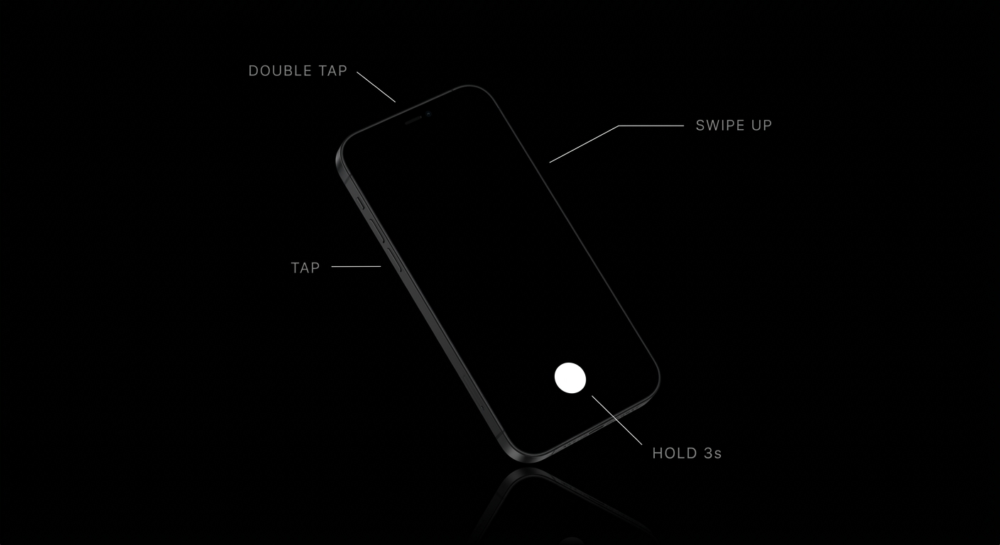

# Puck

Puck is one button. Four gestures. No menus, no onboarding, no configuration. It tells you the one thing you need to know, tells you a joke, calls for help, or answers any question. It works offline. It never sends automatically.



Flutter · Dart 3 · Android 7+ · iOS: source only, never built — see


---

## Try it

```bash
flutter pub get
flutter run
```

The app runs fully offline on first launch with no configuration: tap, double-tap, hold and the local half of swipe-up all work on a phone in airplane mode with nothing set up. To enable open-ended answers on swipe-up, open **Settings**, paste a free key from [console.groq.com/keys](https://console.groq.com/keys), done. That path is optional and demoted.

The zero-setup route for the same thing is `worker/` — a Cloudflare Worker that holds one key so no phone has to, with a kill switch and a daily ceiling, tested by `node --test worker/test/*.test.mjs`. **It is not deployed and no build points at it**: a shared answer service spends the maintainer's money, so the URL arrives as `--dart-define=PUCK_PROXY_URL=...` and the default build sends nothing. See FINDINGS.md §4.1.

Puck ships in **English and Spanish**, completely. A phone set to any other language reads English rather than blanks, and adding a language is one map plus one ARB file (`lib/src/l10n/`, `lib/l10n/`) — the RTL layout work is already in the tree.

A browser-runnable port of the surface lives at `preview/puck_preview.html` — open it in any browser to feel the gestures without a device.

## The four gestures

**Tap** — the one thing worth knowing, ranked by actionability: an event starting within the hour, a battery about to die, rain inside four hours, or just the time and a quiet line. The time card paints on the same frame as the touch; the snapshot only ever upgrades it.

**Double tap** — one dry line from a bag of 100. The bag is shuffled and persisted, so you see every joke before any repeat.

**Hold 3 seconds** — SOS. The sheet counts down for three more seconds; lifting your finger at any point in that countdown cancels everything (a pocket can hold a button by accident, but it can't hold it for six seconds). Holding through the end turns on the torch and opens Messages with your location pre-filled, in your language. Puck never sends anything itself. With no emergency contact set, the sheet offers the local emergency number instead — resolved from the locale, shown as text, and handed to the dialer, never dialled. The hold length is adjustable from Settings (1–3s) for anyone who cannot hold a button for three seconds; the default stays 3s.

**Swipe up** — ask anything. Coin, dice, arithmetic and dates answer instantly, offline, exactly. Everything else streams a one-sentence answer when a key is set, or one honest line when it isn't.

## Where the intelligence lives

Deliberate split. Things that must be correct or instant — arithmetic, coin flips, the time, the guaranteed tap card — are computed on device with no network. Things that must be open-ended go to one model (Groq, `gpt-oss-20b`) through a single seam: `LlmProvider` in, a stream of text out — and, in front of that seam, one gate that the privacy switch controls (`GatedLlmProvider`), so "nothing leaves your phone" is one check rather than a promise repeated in ten screens.

The model can only ever *sharpen* a line the device already chose; it is never allowed to originate facts. Streamed INTENT answers pass a client-side validator before they are allowed on screen (`PuckPrompt.isAcceptable` plus the streaming guard in `IntentRouter`), and a CONTEXT polish that fails the same check is discarded with the deterministic line left in place — so a bad model day degrades to the local answer, never to garbage. Coin, dice, arithmetic, dates and the crisis line never touch the network at all.

Cost is bounded on the device rather than by hope: a polish is skipped when the local line is already shorter than the model's budget, at most one request is made per 20 seconds, and the polish of a given line is reused from a bounded cache for 10 minutes. The tap is the gesture people make dozens of times a day.

## Architecture

```
lib/
├── main.dart, app.dart          entry, routes, theme application
└── src/
    ├── core/                    constants (the tuning surface), theme, motion, format, haptics, expression evaluator
    ├── l10n/                    every word the app says, keyed (en + es); ARB files live in lib/l10n/
    ├── data/
    │   ├── models/              ContextSnapshot — every field nullable, every reader failure-tolerant
    │   ├── services/            battery, calendar, location, weather, torch, messaging, speech, emergency numbers, feedback
    │   ├── repositories/        settings (secure key storage), jokes (shuffle bag), context (parallel gather)
    │   └── llm/                 Groq SSE client, cloud gate, hardened prompt, deterministic local resolver
    ├── domain/                  context ranker (the priority list), intent router (device vs cloud), safety (crisis line)
    ├── settings/, privacy/      the two screens behind the bubble
    └── (repo root) tools/       ARB generation;  worker/  the shared answer service
    └── features/
        ├── puck/                controller, custom gesture recogniser, spring physics, bubble, cards, intent bar, SOS sheet, action list
        ├── settings/            the one configuration screen
        └── privacy/             what leaves the phone, the cloud switch, erase-everything, feedback
```

`tools/gen_arb.py` regenerates the ARB files from the Dart maps; `flutter test` fails if they disagree.

One custom gesture recogniser (`puck_gestureRecognizer.dart`) owns the bubble. Flutter's stock recognisers put tap, double-tap, long-press and vertical-drag in the same arena, and vertical drag wins the moment a finger travels — which kills swipe-up. One recogniser, one pointer, a small state machine classifies every press by distance, time and velocity instead.

Motion is one spring (stiffness 400, damping ratio 0.63) and one easing curve (240ms easeOutCubic). The bubble's drag is a real physics simulation — it decelerates into the edge with the velocity your finger had, which a fixed curve cannot express.

## Permissions

Requested lazily, at the moment a gesture needs them, never at launch: calendar on first tap, location on first weather check or SOS, microphone on first mic press. Deny any of them and Puck degrades — it never nags, and it never breaks. The SOS SMS is handed to the native composer unsent; that extra tap is the feature that makes a pocket-SOS recoverable.

## Verification

```bash
flutter analyze   # no issues found
flutter test      # unit + widget suites
```

The test suite locks the things a demo cannot afford to regress: the arithmetic evaluator, the SOS path's failure states (a blocked GPS fix that still sends, no contact, no SMS app, no dialer, the lifted finger that sends nothing), the string table's contract with its ARB files in both directions, the local resolver's exact answers in two languages ("what's 47 times 83" → `3901.`, and an unknown language matching nothing rather than English), the crisis phrases, the palette's WCAG ratios, the joke bag's contract (exactly 100, no repeats, no exclamation marks), and a widget smoke test of the launch → tap → double-tap → settings path.

**None of those commands has been run yet in the environment this change was written in** — there is no Flutter SDK there. FINDINGS.md §1 lists what was run instead and what remains unverified; please do not treat the suite as passing until `flutter test` says so.

## Demo video

Not recorded yet — `docs/demo.mp4` does not exist, and the README used to describe it as if it did. The script, for whoever records it, in order: launch → tap (time card) → wait → double tap (joke) → swipe up → "flip a coin" → swipe up → "what's 47 times 83" → swipe up → "why is the sky blue" (offline line) → hold 3s → release early (auto-cancel) → hold again, let it fire.
